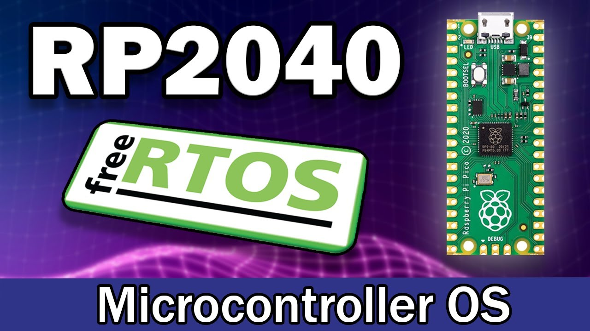

# FreeRTOS on Raspberry Pi Pico

## 1. Description
In this project, I implement **FreeRTOS** to run a blink sketch on Pico while Pico also communicate with my computer by **Serial**.

## 2. Enviroment
- **Set up Pico SDK Enviroment**
    - **Install Cmake**
    - **Install Python**
    - **Install VS Code**
    - **Install MinGW Manager**
    - **Download Pico SDK and Examples**
    - **Install GUN Arm Embedded Toolchain**
    You can find more information about how to set up Pico C++ Toolchain on windows on [shawnhymel](https://shawnhymel.com/2096/how-to-set-up-raspberry-pi-pico-c-c-toolchain-on-windows-with-vs-code/) website.

- **Set up FreeRTOS Enviroment**
    - **Download FreeRTOS-Kernel**
    - **Configure FreeRTOSConfig.h File**
    - **Set up FreeRTOS Enviroment Vairable**

## 3. Write your own Code
You can directly use blink_freertos.uf2 in build folder to your raspberry pi pico, or just cmake yourself.

Note that you must add **FREERTOS_KERNEL_PATH** Enviroment Vairable to your computer.

I find mamy resources about how to write a FreeRTOS sketch,one of it is [PicoCPP's Github repository](https://github.com/PicoCPP/RPI-pico-FreeRTOS).

You can also find information about how to write a FreeRTOSConfig.h in his repository.